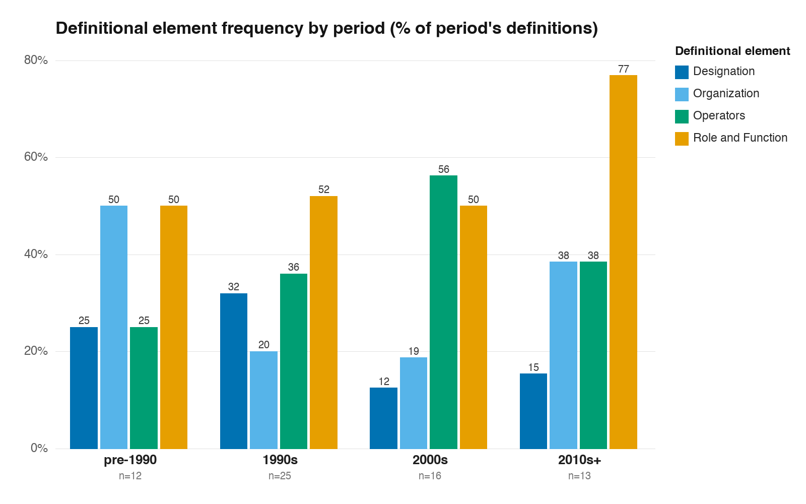
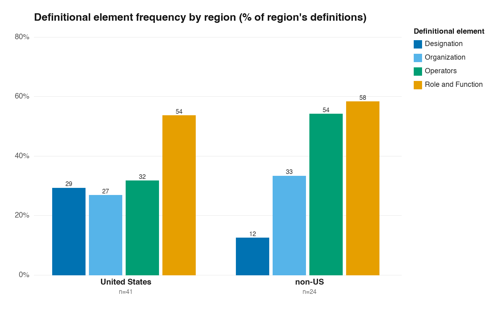
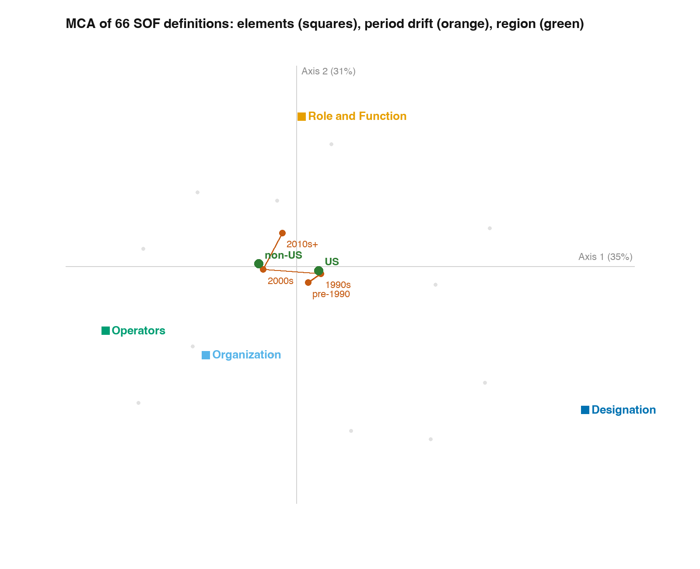

# Comparative Analysis of Special-Operations Definitions Across Time and Place
### Methodological memo · 6 June 2026

## 1. Process

The analysis rests on a corpus of **69 definitions** of special-operations units assembled in three passes. An existing spreadsheet of coded definitions, frozen some years ago, supplied the base layer; cleaning and normalisation reduced it to **41** usable entries, all of them, as it turned out, definitions of "special operations forces." A second pass drew on my Zotero collection **"SOF Articles"** (374 items): after de-duplication against the existing corpus and a filter for items that *define* rather than merely *use* a term, thirteen full-text articles were read and mined, yielding **26** further definitions and the first entries for the adjacent terms (special forces, elite forces, commando). A third pass recovered one additional open-access article from the web (Martin 2014), adding **2** doctrinal definitions. Extraction was AI-assisted: each PDF was read by a subagent instructed to return only verbatim defining passages with page references, which I then coded. The working files — master table, coverage map, and a browsable Drive index — are held under `~/Documents/Claude/Projects/SOF-Definitions/`.

## 2. Sources

The corpus spans **1944–2018** and mixes scholarship with doctrine. Academic authors supply 29 definitions, serving or retired military authors 24, and dual academic-military figures 12. By provenance it is weighted toward the United States (41 of 69), with smaller contributions from the United Kingdom, Canada, Israel, Australia, France, and Ukraine. This composition is a genuine limitation, not a neutral background fact, and it governs how far the spatial findings can be pressed (§6). Every definition retains its full citation and a `provenance` tag distinguishing original entries from newly mined ones.

## 3. Method

The design is **content analysis of definitions** — the standard, replicable instrument for asking how a contested concept is construed across cases. Its canonical application is Schmid and Jongman's dissection of 109 definitions of terrorism into recurring elements,[^1] which I and colleagues later extended in *The Challenges of Conceptualizing Terrorism*.[^2] The procedure is the same here: decompose each definition into the constituent dimension(s) on which it rests, code presence or absence, and tabulate. Each definition is assigned to one or more of four elements — **Designation** (what the unit is called or which command owns it), **Organization** (how it is selected, trained, equipped, structured), **Operators** (the qualities of its personnel), and **Role and Function** (the missions and effects that define it). These correspond to the *secondary-dimension* level of Goertz's three-level account of concept structure.[^3] The two comparative axes the project requires — time and place — are then introduced by cross-tabulating element frequency against period and against region, and, finally, by **multiple correspondence analysis (MCA)**, which projects definitions, elements, periods, and regions into a common low-dimensional space.[^4] MCA is the appropriate multivariate technique because the data are categorical; periods and regions enter as *supplementary* points so that they are positioned by, but do not themselves shape, the element geometry.

## 4. Analysis and Results

**No common core.** Across the 66 codeable definitions, no element is a necessary condition. Role and Function is the modal element but appears in only **56%**; Operators 39%, Organization 29%, Designation 23%. The concept therefore behaves as a **family-resemblance category** in Wittgenstein's sense, and the literature's recurrent complaint of definitional disorder is better read as evidence about the object than as a failure of scholarship.[^5]

**The temporal axis.** Element frequency shifts across periods in an interpretable way:

| Period | Designation | Organization | Operators | Role & Function | n |
|:--|:-:|:-:|:-:|:-:|:-:|
| pre-1990 | 25% | 50% | 25% | 50% | 12 |
| 1990s | 32% | 20% | 36% | 52% | 25 |
| 2000s | 12% | 19% | **56%** | 50% | 16 |
| 2010s+ | 15% | 38% | 38% | **77%** | 13 |

Definition by designation peaks in the years the United States was building and defending a unified special-operations command — when the salient question was *which units belong* — and recedes thereafter. As those forces turned to counter-terrorism and irregular war after 2001, definition by the operator (2000s) and then by role and function (2010s) came to the fore.

**The spatial axis.** Region divides the corpus more sharply on one element than any other:

| Region | Designation | Organization | Operators | Role & Function | n |
|:--|:-:|:-:|:-:|:-:|:-:|
| United States | **29%** | 27% | 32% | 54% | 41 |
| non-US | **12%** | 33% | **54%** | 58% | 24 |

American authors define by designation more than twice as often as others — unsurprising where USSOCOM furnishes a formal criterion of membership — while non-American authors lean toward the operator. The per-country lead elements are consistent: the United Kingdom and Israel tilt to role and operator, Canada to organization (reflecting its doctrinal authors), France to the historical-functional.

**Joint structure (MCA).** 

The first two axes absorb essentially all of the adjusted inertia (Greenacre-adjusted: 76% and 24%). Axis 1 opposes Designation (far right) to Operators and Organization (left) — an institutional-identity versus personnel-and-structure contrast. Axis 2 isolates Role and Function (top). Overlaying the supplementary points reproduces both findings on a single map: the **region** centroids separate along Axis 1 (US toward Designation, non-US toward Operators), and the **period** centroids trace a path from the designation side (1990s) leftward to the operator side (2000s) and upward toward role and function (2010s+). The supplementary points sit near the origin — their separations are real but modest, as the sample size warrants.

## 5. Interpretation

The two axes tell one story. *Where* a definition is written shifts its centre of gravity between an institutional conception (the American "what falls under the command") and an operator-or-mission conception elsewhere; *when* it is written moves it along the same terrain as the strategic problem changes. The definition of a special-operations unit is, in this corpus, a function of the challenge its author's state was facing — which is the claim the book advances.

## 6. Caveats

Three limits bound these results. The corpus is small (n = 66 coded), so all figures are tendencies, not significant differences. It is heavily American (41/69), so the temporal axis is far better evidenced than the spatial one; the US–non-US contrast should be carried by the qualitative exemplars as much as by the percentages. And the coding, though anchored to verbatim passages, was AI-assisted and reflects a single coder's judgment — a second coder and an inter-coder reliability check would be the obvious next step before anything here is published.

---

[^1]: Alex P. Schmid and Albert J. Jongman, *Political Terrorism*, 2nd ed. (Amsterdam: North-Holland, 1988), 5–6.
[^2]: Leonard Weinberg, Ami Pedahzur, and Sivan Hirsch-Hoefler, "The Challenges of Conceptualizing Terrorism," *Terrorism and Political Violence* 16, no. 4 (2004): 777–94.
[^3]: Gary Goertz, *Social Science Concepts: A User's Guide* (Princeton: Princeton University Press, 2006), chap. 2. For the wider concept-formation tradition see Giovanni Sartori, "Concept Misformation in Comparative Politics," *American Political Science Review* 64, no. 4 (1970): 1033–53; and David Collier and Steven Levitsky, "Democracy with Adjectives," *World Politics* 49, no. 3 (1997): 430–51.
[^4]: Michael Greenacre and Jörg Blasius, eds., *Multiple Correspondence Analysis and Related Methods* (Boca Raton: Chapman & Hall/CRC, 2006); Brigitte Le Roux and Henry Rouanet, *Multiple Correspondence Analysis* (Thousand Oaks: Sage, 2010). Adjusted inertias follow Greenacre's correction for the indicator-matrix form.
[^5]: Ludwig Wittgenstein, *Philosophical Investigations*, §§65–71; cf. David Collier and James Mahon, "Conceptual 'Stretching' Revisited," *American Political Science Review* 87, no. 4 (1993): 845–55.
